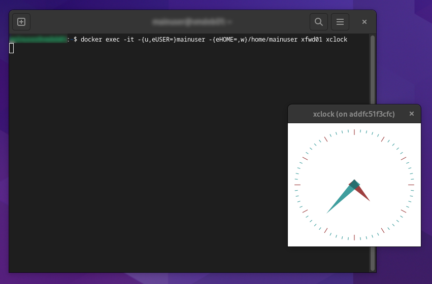

# docker-xfwd

[](https://github.com/dmotte/docker-xfwd/actions)
[](https://hub.docker.com/r/dmotte/xfwd)

:whale: Run **graphical applications** in a Docker container.

> :package: This image is also on **Docker Hub** as [`dmotte/xfwd`](https://hub.docker.com/r/dmotte/xfwd) and runs on **several architectures** (e.g. amd64, arm64, ...). To see the full list of supported platforms, please refer to the [`.github/workflows/main.yml`](.github/workflows/main.yml) file. If you need an architecture that is currently unsupported, feel free to open an issue.

## Simple usage

The simplest way to try this image is:

```bash
docker run -d --name=xfwd01 -v/tmp/.X11-unix/X0:/opt/xfwd/host.sock:ro -v"${XAUTHORITY:?}:/opt/xfwd/host.xauth:ro" dmotte/xfwd
```

Then you can install and run some **graphical application** inside the container:

```bash
docker exec -it xfwd01 bash -ec 'apt-get update; apt-get install -y x11-apps'
docker exec -it -{u,eUSER=}mainuser -{eHOME=,w}/home/mainuser xfwd01 xclock
```



## Standard usage

The [`docker-compose.yml`](docker-compose.yml) file contains a complete usage example for this image. Feel free to simplify it and adapt it to your needs. Unless you want to build the image from scratch, comment out the `build: build` line to use the pre-built one from _Docker Hub_ instead.

To start the Docker-Compose stack in daemon (detached) mode:

```bash
docker-compose up -d
```

Then you can view the logs using this command:

```bash
docker-compose logs -ft
```

Then you can install and run some **graphical application** inside the container:

```bash
docker-compose exec main bash -ec 'apt-get update; apt-get install -y x11-apps'
docker-compose exec -{u,eUSER=}mainuser -{eHOME=,w}/home/mainuser main xclock
```

This image supports **running commands at container startup** by mounting custom scripts at `/opt/startup-early/*.sh` and `/opt/startup-late/*.sh`. This is the same approach used by [dmotte/desktainer](https://github.com/dmotte/desktainer).

## Environment variables

List of supported **environment variables**:

| Variable              | Required               | Description                                                               |
| --------------------- | ---------------------- | ------------------------------------------------------------------------- |
| `MAINUSER_NAME`       | No (default: mainuser) | Name of the main user                                                     |
| `MAINUSER_NOPASSWORD` | No (default: `false`)  | Whether or not the main user should be allowed to `sudo` without password |

## Development

If you want to contribute to this project, you can use the following one-liner to **rebuild the image** and bring up the **Docker-Compose stack** every time you make a change to the code:

```bash
docker-compose down && docker-compose up --build
```

> **Note**: I know that this Docker image has many **layers**, but this shouldn't be a problem in most cases. If you want to reduce its number of layers, there are several techniques out there, e.g. see [this](https://stackoverflow.com/questions/39695031/how-make-docker-layer-to-single-layer)
